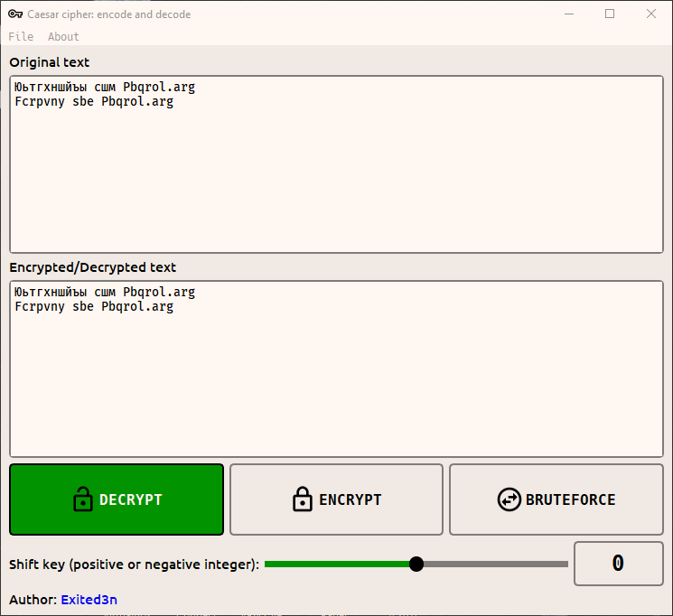

### Main window GIF


#### Build project
```bash
pip install nuitka
pip install ordered-set
pip install zstandard
```

```bash
nuitka --mingw64 --onefile --enable-plugin=pyside6 --windows-disable-console --windows-icon-from-ico=res\key.ico  --remove-output -o caesar_cipher.exe main.py
```